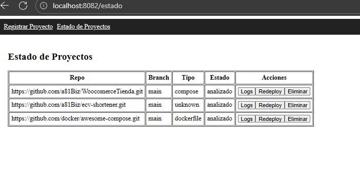

# docker-sammcore-deployer

Repositorio de empaquetado y despliegue para **SAMMCORE-Deployer**.  
Aquí no está el código fuente (vive en [`sammcore-deployer`](https://github.com/a81Biz/sammcore-deployer)),  
sino la infraestructura Docker que permite levantarlo y probarlo localmente como si ya corriera en SAMMCORE.

---

## 📂 Arquitectura de este repo

```

docker-sammcore-deployer/
├─ backend/          # Imagen backend Go (solo API)
│  └─ Dockerfile
├─ frontend/         # Imagen frontend NGINX (sirve build Vite + proxy /api)
│  ├─ Dockerfile
│  └─ nginx.conf
├─ docker-compose.yml
├─ .env.example      # ejemplo de configuración local (copiar como .env)
└─ README.md

````

---

## 🚀 Servicios

- **deployer-backend**  
  - Compila el backend Go desde `sammcore-deployer/backend`.  
  - Expone API en `:8080` dentro del contenedor.  
  - En local se mapea a `http://localhost:8083`.  

- **deployer-frontend**  
  - Construye el frontend React/Vite (`npm run build`) desde `sammcore-deployer/frontend`.  
  - Sirve el `dist/` con NGINX.  
  - Redirige `/api/*` → backend.  
  - En local se mapea a `http://localhost:8084`.  

---

## 🔑 Variables de entorno

Este proyecto requiere un **`GITHUB_TOKEN`** válido para poder analizar repositorios privados o con límites extendidos.

1. Copia `.env.example` a `.env`.  
2. Edita el archivo `.env` y coloca tu token:

```env
GITHUB_TOKEN=ghp_xxxxxxxxxxxxxxxxxxxxxxx
````

> ⚠️ Importante: **nunca subas tu `.env` al repo**. Está en `.gitignore`.

---

## 🐳 Uso local

1. Clonar este repositorio:

```bash
git clone https://github.com/a81Biz/docker-sammcore-deployer.git
cd docker-sammcore-deployer
```

2. Crear `.env` desde el ejemplo:

```bash
cp .env.example .env
```

3. Levantar con Docker Compose:

```bash
docker-compose up -d --build
```

4. Acceder en el navegador:

   * UI: [http://localhost:8084](http://localhost:8084)
   * API: [http://localhost:8083/status](http://localhost:8083/status)

---

## 🖥️ Flujo esperado

* **Registrar Proyecto:** se ingresa un repositorio GitHub y branch.
* El backend lo analiza y lo clasifica (`compose`, `dockerfile`, `unknown`).
* La **pantalla de Estado de Proyectos** muestra tabla con:

  * Repo, Branch, Tipo, Estado.
  * Acciones: `Logs`, `Redeploy`, `Eliminar`.

Ejemplo de vista:



---

## 🛡️ Producción en SAMMCORE (Fase 4)

Cuando el Deployer viva en SAMMCORE:

* **Backend**: se instalará el binario Go como servicio `systemd`.
* **Frontend**: el `dist/` se servirá desde `/var/www/deployer/`.
* **NGINX global** en SAMMCORE publicará:

```nginx
server {
    listen 443 ssl;
    server_name deployer.sammcore.local;

    ssl_certificate     /etc/nginx/certs/sammcore.crt;
    ssl_certificate_key /etc/nginx/certs/sammcore.key;

    # Frontend
    location / {
        root /var/www/deployer;
        index index.html;
        try_files $uri /index.html;
    }

    # Backend
    location /api/ {
        proxy_pass http://127.0.0.1:8081/;
    }
}
```

---

## 🔮 Roadmap

* **Fase 3 (actual):** validación en contenedores con frontend + backend separados.
* **Fase 4:** migrar a despliegue directo en SAMMCORE host (binario + NGINX global).
* **Futuro:** integración con K3s para despliegue automático de proyectos.